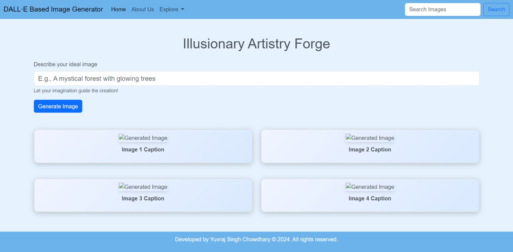
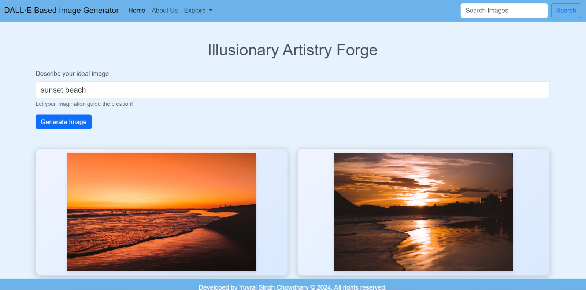

# Illusionary Artistry Forge


Welcome to the Illusionary Artistry Forge, an advanced DALL·E-based image generator!

  

## Features

- **DALL·E Integration**: Leverages OpenAI's DALL·E API to generate unique images from text prompts.
- **Dynamic Image Generation**: Enter a text prompt and receive a set of AI-generated images.
- **Stylish Interface**: User-friendly design with a sleek and modern look.

## Prerequisites

- Python installed on your machine.
- An OpenAI API key (from [OpenAI](https://platform.openai.com/signup)).
- Flask, and other required Python libraries.

## Installation

### Clone the Repository

```bash
git clone https://github.com/chowdhary19/Illusionary_Artistry_Forge.git
cd Illusionary_Artistry_Forge
```

### Install Dependencies

```bash
pip install -r requirements.txt
```

### Set Up Your Environment Variables

Create a `.env` file in the root directory and add your OpenAI API key:

```
OPENAI_API_KEY=your_openai_api_key_here
```

## Usage

### Start the Server

```bash
python app.py
```

### Interact with the Application

Open your web browser and navigate to `http://127.0.0.1:5000` to use the image generator. Enter a text prompt, click "Generate Image," and view your AI-generated images.

## Example

Here's an example of how to set up and run the Discord Chatbot with Google Gemini API:

```text
Welcome to the Discord Chatbot powered by Google Generative AI's Gemini 1.5 model!

Features
- Discord Integration: The bot listens to messages in Discord channels.
- Gemini Response Generation: Utilizes the Google Gemini API to generate responses to messages.
- Context Switching: Use !setcontext <file_number> command to switch context based on predefined chat logs.
```

  

## References

- [OpenAI DALL·E API Documentation](https://platform.openai.com/docs/guides/images)
- [Flask Documentation](https://flask.palletsprojects.com/)
- [Bootstrap Documentation](https://getbootstrap.com/docs/5.3/getting-started/introduction/)

## Developer Info


- **LinkedIn**: [Connect with me on LinkedIn](https://www.linkedin.com/in/yuvraj-singh-chowdhary/)
- **Reddit**: [Follow me on Reddit](https://www.reddit.com/user/chowdhary19)
- **GitHub Repo**: [GitHub Repository](https://github.com/chowdhary19/YuvDALL.E.git)

## Special Thanks

Special thanks to Mrs. Geetika Singh for her invaluable guidance and support throughout the development of this project.

---

This project aims to advance the understanding and implementation of AI-generated imagery using cutting-edge deep learning methods. Explore creative concepts through this interactive and visually appealing web application.
